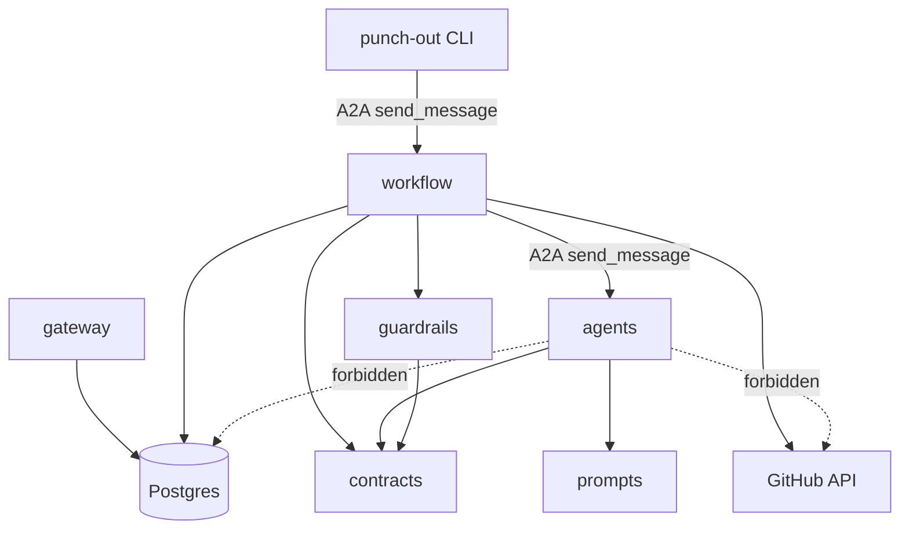
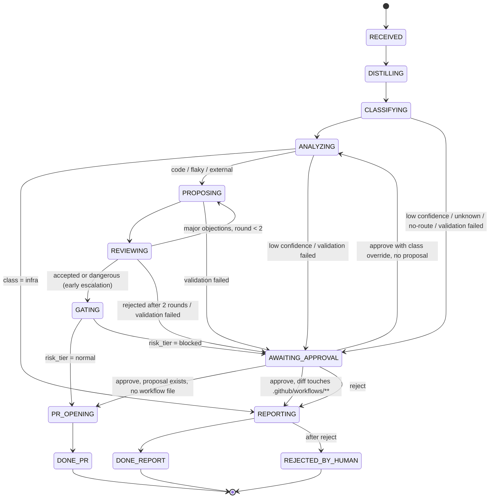
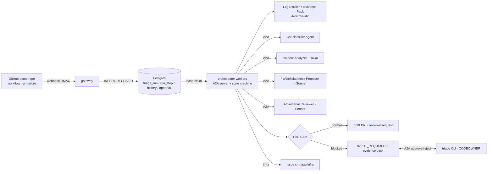
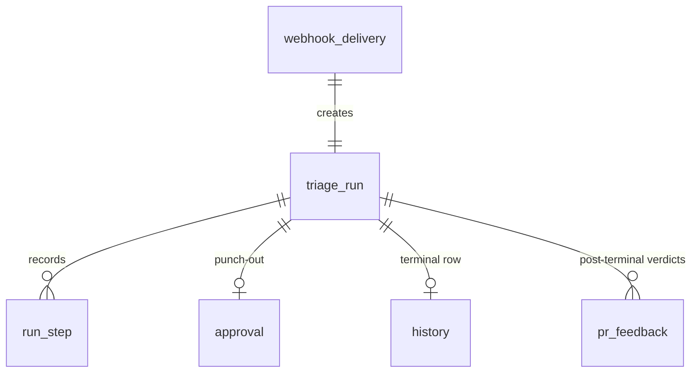
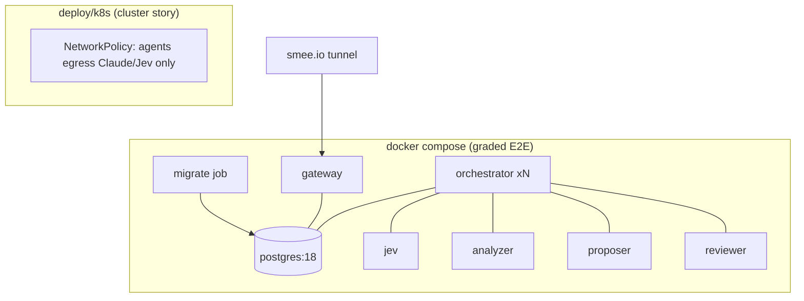

# Architecture Spine — Blameless CI Triage

## Design Paradigm

**Hub-and-spoke process manager.** One orchestrator (itself an A2A server) owns every run's state in Postgres and drives an explicit, table-defined state machine. Spokes are stateless A2A agents: pure functions from an evidence pack to a typed result. Evidence flows through a **pipes-and-filters** front end (deterministic Log Distiller + evidence pack → Jev classify → LLM reasoning), so no LLM ever sees raw logs. Routing, suspect narrowing and owner notification are deterministic orchestrator tools, not agents.

| Layer | Directory | May call |
| --- | --- | --- |
| Ingress | `gateway/` | Postgres (enqueue only) |
| Process manager | `workflow/` | `contracts/`, `guardrails/`, Postgres, GitHub API, A2A clients → `agents/*`, Jev (routing) |
| Guardrails (pure, deterministic) | `guardrails/` | `contracts/` only |
| Spoke agents | `agents/{jev,analyzer,proposer,reviewer}/` | `contracts/`, `prompts/`, own model API only |
| Shared types | `contracts/` | nothing |
| Human punch-out | `punch-out/` (CLI) | orchestrator A2A endpoint only |



## Invariants & Rules

### AD-1 — Orchestrator is a hand-rolled explicit state machine [ADOPTED]

- **Binds:** `workflow/`, all orchestrator workers
- **Prevents:** implicit flow hidden in call chains; grader unable to see branching/revision; states with missing exits
- **Rule:** Run state is a `triage_run.state` column. All legal moves live in one transition table in `workflow/`; any transition not in the table raises, and the diagram below is generated from that table. Workers claim runs per AD-23; N workers = concurrency cap. No workflow engine (DBOS/Temporal) in v1. `AWAITING_APPROVAL` stores `escalation_reason ∈ {low_confidence, unknown_class, no_route, validation_failed, review_rejected, gate_blocked}` and an optional `proposal_step_id`.



Any non-terminal state may also move to `FAILED` (AD-22).

### AD-2 — Resume from last completed step

- **Binds:** `workflow/`, `run_step`
- **Prevents:** double LLM spend, duplicated audit rows, inconsistent state after a worker crash
- **Rule:** A step's output row (`run_step`) and the `triage_run.state` transition commit in **one transaction**, guarded by the lease (AD-23). A reclaimed run re-enters at its current state; completed steps are never re-executed.

### AD-3 — Side effects are idempotent

- **Binds:** `PR_OPENING`, `REPORTING`, any GitHub write
- **Prevents:** duplicate draft PRs, issues or comments on resume
- **Rule:** Every GitHub write is keyed `run_id + step`; branch name `triage/<run_id>`; check-before-create. PRs are always `draft: true`; nothing ever merges.

### AD-4 — `triage_run` is the sole owner of run state

- **Binds:** `workflow/`, orchestrator A2A server, `punch-out/`
- **Prevents:** two owners of run state (a2a-sdk task store vs our table) diverging; approvals the SDK can't find
- **Rule:** The orchestrator's A2A task state is a one-way projection of `triage_run.state`, served by a **read-only `TaskStore` adapter** over `triage_run`/`run_step` (A2A `task_id` = `run_id`). The a2a-sdk `DatabaseTaskStore` / `a2a-db` tables are not deployed. The approval handler only calls a guarded transition from `AWAITING_APPROVAL`. For spoke calls, `run_id` travels as the A2A `contextId`.

| `triage_run.state` | A2A `TaskState` | `terminal_state` (contract) |
| --- | --- | --- |
| RECEIVED | SUBMITTED | — |
| DISTILLING … GATING, PR_OPENING, REPORTING | WORKING | — |
| AWAITING_APPROVAL | INPUT_REQUIRED | `input_required` |
| DONE_PR | COMPLETED | `pr_opened` |
| DONE_REPORT | COMPLETED | `report_sent` |
| REJECTED_BY_HUMAN | COMPLETED (`outcome=rejected_by_human`) | `rejected_by_human` |
| FAILED | FAILED | `failed` |

### AD-5 — Spokes are stateless; calls are blocking

- **Binds:** `agents/*`, A2A client in `workflow/`
- **Prevents:** agent-held state that the orchestrator can't resume or audit
- **Rule:** Orchestrator → spoke = blocking, non-streaming `send_message` over the JSON-RPC binding, bounded by a per-skill `step_timeout` (config). The result is persisted as `run_step` before the next call. Spokes hold no meaningful task state, no GitHub token, no DB access. Repo context travels in the request.

### AD-6 — Contracts are Pydantic; schemas are generated [ADOPTED]

- **Binds:** `contracts/`, `guardrails/schemas/`, all A2A DataParts, all `*.test.yaml` `is-json` assertions, red-team JS asserts
- **Prevents:** per-agent verdict shapes drifting apart
- **Rule:** Every inter-agent payload is a Pydantic v2 model in `contracts/` (single source). JSON Schema is generated into `guardrails/schemas/` and committed; CI fails if regenerated schema differs. `TriageVerdict` always carries `class`, `confidence`, `confidence_jev`, `caps[]`, `suspects[]`, `citations[]`, `risk_tier`, `terminal_state` (null while running), `proposed_diff` (nullable), `quarantine` (nullable). Enums and shapes:
  - `risk_tier`: `normal | blocked | not_gated` (always present)
  - `terminal_state`: see AD-4 table
  - `proposed_diff`: `{base_sha, files: [{path, op: add|modify|delete, new_content}]}`
  - `suspects[]`: `{sha, author_login, rank, citations[]}` (AD-27)
  - Reviewer objection: `{severity: info|minor|major|dangerous, category, claim, citation}`
  - All SHAs are full 40-char. A unique ≥7-char prefix is accepted only at the dry-run boundary (AD-26).

### AD-7 — Strict citations

- **Binds:** Analyzer, Proposer, Reviewer outputs; `guardrails/citation_check`
- **Prevents:** uncited blame; injected text fabricating evidence
- **Rule:** Citation kinds are closed: `log_line | commit | metric | history_row | jev_signal`, each with a locator. The orchestrator validates each against the evidence pack it served this run: log line number exists in the numbered distilled log; SHA ∈ `last_green..HEAD`; `history_row` `row_id` ∈ rows served; metric key ∈ collected runner metrics; `jev_signal` ∈ answers from this run's Jev call. Any unresolvable or missing citation = schema failure.

### AD-8 — Validation failure policy

- **Binds:** every agent step (CLASSIFYING, ANALYZING, PROPOSING, REVIEWING)
- **Prevents:** retry loops; silently accepting unvalidated output
- **Rule:** On schema/citation failure: one retry with validator errors fed back. Second failure → `AWAITING_APPROVAL(validation_failed)`. Never emit an uncited verdict. These retries are separate from the transient retries in AD-22.

### AD-9 — One confidence number: Jev `Choice.confidence`

- **Binds:** classification branch, risk gate, calibration table, Triage Card, `jev.test.yaml`
- **Prevents:** gate and calibration reading different numbers
- **Rule:** `confidence_jev` = Jev `Choice` answer `.confidence` for the failure class; it is immutable once written. `confidence` (the one every consumer reads) = `min(confidence_jev, caps…)`. Each cap is added by a Claude agent or a deterministic signal and carries a cited reason. Nothing may raise it. Jev `probabilities` are stored in audit only.
  **Human class override (AD-14):** it changes neither `confidence_jev` nor `confidence`. A recorded `class_override` replaces only the low-confidence and unknown-class cutoff checks for the rest of that run. Validation (AD-8), review (AD-12) and the risk gate (AD-13) still apply, so the run can still pause for those reasons. `confidence` stays below the cutoff, so AD-27 blame-free output still applies.

### AD-10 — Two-stage discovery over an allowlisted, digest-pinned registry

- **Binds:** `workflow/registry`, `agents/*` Agent Cards
- **Prevents:** rogue or silently-changed Agent Cards; ambiguous routing
- **Rule:**
  - **Registry:** a committed allowlist `{card_url, sha256}`, one file per environment (compose, k8s). The digest is taken over canonical JSON with URL fields excluded.
  - **Card checks:** cards are fetched from `/.well-known/agent-card.json` at startup. A card is refused on a digest mismatch (a description change needs re-approval by PR) or if it declares any skill id outside the catalogue in Conventions. A duplicate `skill_id` across cards makes the orchestrator refuse to start.
  - **Stage 1 routing:** exact skill id/tag match.
  - **Stage 2 routing:** Jev `Choice(criteria={skill_id: card skill description})` over allowlisted skills only.
  - **No route:** below the no-route cutoff, the run goes to `AWAITING_APPROVAL(no_route)`. This replaces the "no-route error" in the brainstorm.

### AD-11 — Jev call shape

- **Binds:** `agents/jev/`, `workflow/` routing, `jev.test.yaml`
- **Prevents:** divergent Jev usage / double calls on the same log; class descriptions drifting between agent and eval
- **Rule:** One `system_one` call on the distilled log carries both the 5-class `Choice` and the injection pre-screen `Noul`. The classes are `code | flaky | infra | external | unknown`. The class descriptions and the Noul instruction live once in `prompts/jev-classes.yaml`. A positive injection screen adds a cited cap (`jev_signal`); it never blocks on its own.

### AD-12 — Revision loop

- **Binds:** Proposer, Reviewer, `workflow/`
- **Prevents:** unbounded loops; two authors of one fix
- **Rule:** The Reviewer returns only structured objections (AD-6) and never edits the diff; the Proposer is the sole author.
  - **Accepted:** no `major` or `dangerous` objections.
  - **Revise:** `major` → revise while `revision_round < 2`; still rejected after that → `AWAITING_APPROVAL(review_rejected)` with the objections.
  - **Dangerous:** any `dangerous` objection escalates early to `GATING`, which blocks.
  - **Provenance:** every PR-producing run carries the Reviewer verdict.

### AD-13 — Risk gate is deterministic and has the last word before GitHub

- **Binds:** `guardrails/risk_gate`, `GATING`
- **Prevents:** a deflake that hides a bug; AI deciding high-impact actions
- **Rule:** `risk_tier = blocked` if the diff:
  - skips, disables or xfails a test
  - adds retries
  - increases timeouts
  - loosens assertions
  - touches `.github/workflows/**`, secrets or infra manifests
  
  It is also `blocked` if the Reviewer marked the change `dangerous`. Blocked → `AWAITING_APPROVAL(gate_blocked)`. Only `normal` proceeds to `PR_OPENING`. LLM output cannot override the gate.

### AD-14 — Punch-out: A2A CLI + CODEOWNERS authority

- **Binds:** `punch-out/`, orchestrator A2A server, `approval` table
- **Prevents:** anyone who can reach the orchestrator approving risk; a blocked change approving itself; approving something other than what was reviewed
- **Rule:**
  - **Evidence to the human:** the `INPUT_REQUIRED` status message carries the evidence-pack artifact, blame-free per AD-27.
  - **Command:** the human responds with `triage approve|reject <task_id> [--class <c>] --note …`, sent as A2A `send_message` on the same `task_id`.
  - **Authentication:** the call uses the caller's GitHub user token, declared in the orchestrator card's `securitySchemes`. The orchestrator's own auth middleware validates it (`GET /user`), and unauthenticated calls are rejected before any check.
  - **Authorisation:** the login must be a CODEOWNER (user or team) of the paths the blocked change touches (fallback `*`). CODEOWNERS is read **only from the protected default-branch tip**.
  - **Recording:** the approval row binds `proposal_step_id` + diff sha256. The token is never persisted; login, decision, note and timestamp are.
  - **Outcomes:** follow the AD-1 edges.
  - **Class override:** `--class` is valid only when the task has no `proposal_step_id`; the approval row records `class_override`. Its effect on confidence is fixed by AD-9.
  - **Workflow files:** approving a diff that touches `.github/workflows/**` moves to `REPORTING`, not `PR_OPENING`. The report carries the approved diff for a human to apply (AD-16).
  - **Bypass evidence:** refused attempts (non-owner, unauthenticated, wrong state) are audited. No path from `blocked` to `PR_OPENING` exists except via an `approval` row.
  - **Comment command (SHOULD):** a PR comment `/triage` enters via the gateway and becomes the same A2A message.

### AD-15 — Tenant isolation and history ownership

- **Binds:** all queries, `history`, evidence pack
- **Prevents:** cross-repo leakage; history poisoning by agents or via free text; two writers of history
- **Rule:**
  - **Tenant scope:** every history and run query is bound to the task's `repo_id`; LLM context never mixes repos.
  - **Writer:** only the orchestrator writes `history`, one row at a run's terminal state, including the human verdict. Seed rows enter only through a `history import` command.
  - **Row shape:** rows are **structured-only** (enumerated fields, no free text), keyed by `fingerprint` = sha256 of normalised `test_id + error_type + top stack frames`, and cited by `row_id`.
  - **Agent access:** agents see history only as rows served in their evidence pack.
  - **Feedback:** post-terminal human PR verdicts go to a separate `pr_feedback` table.

### AD-16 — Least privilege and secret placement

- **Binds:** GitHub App, deploy config, all services
- **Prevents:** an injected agent acting on GitHub; the App merging; secret leakage via logs or runs
- **Rule:**
  - **GitHub App permissions:**
    - `actions:read`, `checks:read`
    - `contents:write`, used only for `refs/heads/triage/*`. This is enforced in code, and the default-branch ruleset requires human review with the App not a bypass actor.
    - `pull_requests:write` (draft only)
    - `issues:write` (infra report issue and comments)
    - org `members:read`
    - **Never** the `workflows` permission, so GitHub itself rejects pushes to `.github/workflows/**`. Such diffs never reach `PR_OPENING`: the risk gate blocks them (AD-13) and an approval moves them to `REPORTING` (AD-14). A push GitHub still rejects for lacking `workflows` is a non-retryable error → `FAILED` (AD-22).
  - **Installation token:** minted per step and held only by the orchestrator.
  - **Keys:** the App private key lives only in the gateway and orchestrator; the Claude key only in the 3 Claude agents; the Jev key in the Jev agent and orchestrator.
  - **Leak prevention:** secrets never appear in `runs/`, logs or prompts.
  - **Cluster:** on k8s, NetworkPolicy limits LLM agent egress to the Claude and Jev APIs.
  - **Red-team plan:** `redteam-plan.md` and the promptfoo `purpose` list these scopes.

### AD-17 — Ingress

- **Binds:** `gateway/`
- **Prevents:** forged, replayed or flooding webhooks; slow acks; duplicate runs
- **Rule:**
  - **Events:** accept only `workflow_run` completed/failure, plus `issue_comment` for the SHOULD command.
  - **Signature:** verify `X-Hub-Signature-256` with `hmac.compare_digest` before parsing; a bad signature gets 401.
  - **Installation:** reject an unknown `installation.id`.
  - **Replay:** a replayed `X-GitHub-Delivery` gets a 2xx no-op.
  - **Run identity:** unique `(repo_id, workflow_run_id, run_attempt)`.
  - **Load limits:** a per-installation rate limit and a queue-depth cap per repo.
  - **Accept:** insert `triage_run(RECEIVED)` and return 202.
  - **Boundaries:** no LLM or GitHub calls in the gateway.

### AD-18 — Audit and cost are computed by the orchestrator

- **Binds:** `run_step`, `monitoring/`, `runs/`, `results/`
- **Prevents:** inconsistent or missing token/cost accounting
- **Rule:**
  - **Scope:** every LLM and Jev call is recorded as a `run_step`, whether a spoke or the orchestrator makes it (routing included).
  - **Fields:** model; `input_tokens`, `output_tokens`, `cache_read_input_tokens`, `cache_creation_input_tokens` split 5m/1h; status; outcome. Tokens not reported are stored as NULL, never 0.
  - **Cost:** the orchestrator computes it from one versioned `monitoring/prices.yaml` (a rate per token type per model, plus source URL and retrieved date). An unpriced model yields a NULL cost, flagged.
  - **Exports:** `runs/` and `results/` are exports of these tables, never hand-written.

### AD-19 — One copy of each prompt; one thresholds file

- **Binds:** `prompts/`, `agents/*`, `*.test.yaml`, `guardrails/thresholds.yaml`
- **Prevents:** evaluated prompt ≠ deployed prompt; components using different cutoffs
- **Rule:** Each system prompt (and `jev-classes.yaml`) exists once in `prompts/`; agents load it at runtime and promptfoo references the same file. All cutoffs live only in `guardrails/thresholds.yaml`: class branch, no-route, injection screen, distiller max bytes. Model IDs and `step_timeout` per agent come from config, never code. Do not rely on `temperature` (removed in anthropic SDK 1.x).

### AD-20 — Untrusted data boundary

- **Binds:** all prompts, Log Distiller, registry → Jev criteria
- **Prevents:** logs, commits, PR titles, history, or Agent Card text acting as instructions
- **Rule:**
  - **Distiller:** no LLM sees raw CI logs; only Log Distiller output. The distiller takes CI log text and JUnit XML, keeps error blocks and stack traces, drops narrative lines outside them, strips ANSI/control characters, numbers the lines, and truncates at max bytes.
  - **Untrusted text:** the distilled log, commit messages, PR title, history rows and Agent Card descriptions are passed inside delimited data sections marked untrusted, never concatenated into instructions.

### AD-21 — Quarantine is never in the diff

- **Binds:** Proposer (flaky variant), risk gate, S2
- **Prevents:** S2's deflake tripping the gate; quarantine used to hide a bug
- **Rule:** Quarantine is the `quarantine` recommendation field (test id + reason + citations), applied as a PR label and a quarantine-list entry in the PR body. It is never written into `proposed_diff`. A flaky `proposed_diff` must be a root-cause change that passes AD-13.

### AD-22 — Transient retries and FAILED

- **Binds:** `workflow/`, every step
- **Prevents:** transient API errors ending runs; silent retry storms
- **Rule:** Transient errors (network, 429, 5xx, timeout, a retryable `AgentError`) get up to 3 attempts with backoff, each recorded as its own `run_step`. After that the run goes to `FAILED`, which is terminal and writes history. A re-drive is a GitHub re-run of the workflow: it produces a new `run_attempt` and enters through normal intake as a new run (AD-17 key). v1 has no manual re-insert.

### AD-23 — Lease and fencing

- **Binds:** orchestrator workers, `triage_run`
- **Prevents:** two workers executing the same run during a multi-minute LLM call
- **Rule:** Claim = a short transaction (`SELECT … FOR UPDATE SKIP LOCKED` on rows with no lease or an expired `lease_until`) that sets `lease_owner`/`lease_until` and commits before any external call. Long steps renew the lease. The step-commit transaction re-checks `lease_owner`; on a mismatch it discards the result.

### AD-24 — Evidence pack is built deterministically

- **Binds:** DISTILLING, all agents, citation check, dry-run
- **Prevents:** agents inventing suspects or evidence; unaudited narrowing
- **Rule:**
  - **Built in DISTILLING:** the orchestrator builds one `EvidencePack`, stored as a `run_step`. It holds the numbered distilled log, `last_green` (the most recent successful run of the same workflow on the same branch; else the default-branch head), the `last_green..HEAD` commits with full SHAs, and `candidate_suspects`.
  - **Candidate suspects:** commits whose changed files intersect the stack-trace files or test imports, ranked deterministically.
  - **Also included:** history rows (AD-15) and runner metrics.
  - **Agent limits:** the Analyzer may choose suspects only from `candidate_suspects`. Every citation must resolve against this pack (AD-7).

### AD-25 — Operational envelope

- **Binds:** `deploy/`, all services
- **Prevents:** environments drifting; unrecoverable data or secrets
- **Rule:**
  - **Images:** the same images run under Compose (dev + graded E2E, smee.io tunnel, synthetic demo repo only) and plain k8s manifests (cluster).
  - **Migrations:** forward-only SQL, applied by a one-shot job before workers start.
  - **Backups:** `pg_dump` before each graded batch.
  - **Secret rotation:** the webhook secret rotates with two secrets accepted during rotation.
  - **Secret sources:** `.env` under Compose, `Secret` objects on k8s.
  - **Logging:** structured JSON logs.
  - **Smoke test:** a signature check through the smee tunnel.

### AD-26 — Dry-run evaluation entrypoint

- **Binds:** orchestrator, `promptfooconfig.redteam.yaml`, `*.test.yaml` E2E-level cases
- **Prevents:** red-team targets that bypass the real pipeline or cause side effects
- **Rule:** The test-only skill `triage-dry-run` is disabled by prod config. It runs the real pipeline up to and including GATING with no GitHub writes. For AD-7 it treats the supplied `commit_messages` and `history_context` as the served evidence. It rejects a `repo_id` not in the fixture map. It returns `{verdict: TriageVerdict}` with `terminal_state` projected as in AD-4.

### AD-27 — Blame requires a commit citation

- **Binds:** Analyzer, validator, Triage Card, reports, PR body
- **Prevents:** the wrong dev being blamed; names leaking into uncertain output
- **Rule:**
  - **Suspect citations:** every `suspects[]` entry needs a `commit` citation plus at least one `log_line` citation, or the validator rejects it.
  - **Blame-free output:** output for `AWAITING_APPROVAL`, `REPORTING`, or any run where `confidence` is below the class cutoff contains no author attribution.
  - **Owner notification:** deterministic. When the run is not blame-free, the orchestrator requests the rank-1 suspect's author as reviewer on the draft PR. When it is blame-free (for example after a class override below the cutoff), it requests the approving CODEOWNER instead. Infra reports go to an issue labelled `ci-triage/infra` for on-call.

## Consistency Conventions

| Concern | Convention |
| --- | --- |
| IDs | `run_id` = UUIDv7 = A2A `task_id` = spoke `contextId`; SHAs full 40-char |
| Skill catalogue | `classify-failure`, `analyze-failure`, `propose-fix`, `review-fix`, `triage-dry-run` (test only) |
| Failure class enum | `code`, `flaky`, `infra`, `external`, `unknown` (red-team YAML `external-dep` → `external`) |
| Risk tier enum | `normal`, `blocked`, `not_gated` |
| Terminal state enum | `pr_opened`, `report_sent`, `input_required`, `rejected_by_human`, `failed` |
| Times | UTC ISO-8601 in JSON; `timestamptz` in Postgres |
| Errors | spoke errors return A2A `FAILED` with `contracts.AgentError {code, message, retryable}` |
| Logging | structured JSON, `run_id` + `task_id` + `step` on every line; no secrets, no raw logs |
| Config | env vars for secrets; YAML for thresholds, prices, registry, model IDs, timeouts |
| Branch / PR | branch `triage/<run_id>`; PR title prefix `[triage:<class>]`; always draft; rank-1 suspect requested as reviewer |
| Scenario success (expected state) | S1 `pr_opened` (fix, correct rank-1 suspect); S2 `pr_opened` (root-cause deflake + quarantine label); S3 `report_sent` (infra issue, no PR); S4 `pr_opened` (mock/contract); S5 `input_required`, then approve/reject recorded |
| Rubric agents → components | Classifier = `agents/jev`; Analyzer = `agents/analyzer`; Fix/Deflake/Mock = `agents/proposer` (one prompt, three variants, each with cases in `proposer.test.yaml`); Reviewer = `agents/reviewer`; Router/Notifier = deterministic in `workflow/` |

## Stack

| Name | Version |
| --- | --- |
| Python | ≥ 3.10 (a2a-sdk floor) |
| a2a-sdk (`http-server` extra; no `postgresql` extra) | 1.1.5 |
| typesafe-sdk (Jev / System One) | 0.7.1 |
| anthropic | 1.8.0 |
| pydantic | 2.13.5 |
| psycopg | 3.3.6 |
| PostgreSQL | 18 (`postgres:18` image) |
| promptfoo (npm) | 0.123.1 |
| smee-client (npm) | 5.0.0 |
| Claude models | Analyzer `claude-haiku-4-5-20251001`; Proposer + Reviewer `claude-sonnet-5` |
| Runtime | Docker Compose (dev + graded E2E); plain k8s manifests (cluster) — same images |

## Structural Seed







```text
./
  prompts/          analyzer.md proposer.md reviewer.md jev-classes.yaml   # single copy (AD-19)
  workflow/         state machine + transition table, registry, A2A client/server, TaskStore adapter, evidence pack, step runners
  guardrails/       schemas/ (generated), validator, citation_check, risk_gate, thresholds.yaml
  agents/           jev/ analyzer/ proposer/ reviewer/   # A2A servers + Agent Cards
  contracts/        Pydantic models (AD-6)
  gateway/          webhook ingress
  punch-out/        triage CLI + captured escalation/bypass evidence
  monitoring/       prices.yaml, exporters
  runs/             per-run audit exports
  results/          E2E batch summary, calibration table, redteam/findings.md
  test-data/        S1–S5 scenario drivers, seeded demo-repo commits, labelled distilled logs, history seed
  tests/            unit + security/ (pytest: gateway, registry, distiller, history scoping, risk gate)
  deploy/           compose.yaml, k8s/, registry.<env>.yaml, migrations/
  analyzer.test.yaml proposer.test.yaml reviewer.test.yaml jev.test.yaml
  promptfooconfig.redteam.yaml
  README.md
```

## Deferred

- **Threshold values:** the file and its readers are fixed (AD-19). The values come from the calibration run on seeded data. Starting guess [ASSUMPTION]: 0.75 class, 0.6 route.
- **Per-agent promptfoo pass bar:** waiting on the Stage 3 quality bar. If the Analyzer (Haiku) fails it, switch to Sonnet via config.
- **Claude prices:** verified 2026-09-25 (memlog) and copied into `prices.yaml` at build. Jev price not found, so Jev stays unpriced (NULL) until sourced.
- **Haiku 4.5 lifecycle:** retirement is "not sooner than 2026-10-15". Check the deprecations page at build; the model ID is config.
- **Approval TTL:** none in v1. A run waits in `AWAITING_APPROVAL` indefinitely.
- **Superseding stale runs** (a newer push fails with the same fingerprint), **coalescing and priority lanes:** COULD. Adding them needs a new AD on run supersession.
- **Signed Agent Cards:** v2 (a2a-sdk `signing` extra). v1 uses digest pins.
- **OpenTelemetry:** v2 (`a2a-sdk[telemetry]`). v1 uses audit tables and JSON logs.
- **DBOS/Temporal durable execution:** v2, if hand-rolled resume grows.
- **Triage Card, feedback-to-promptfoo loop:** SHOULD. They read `TriageVerdict` and `pr_feedback` and write via AD-3 keys.
- **RT-05 routing dry-run** (candidate cards as input): deferred until routing is built. Card checks are covered by pytest.
- **Second language, Jev risk scorer:** COULD.
- **Vector RAG, bisect, self-verifying fix, language specialists, watcher/architect reports:** WON'T in v1.
- **Full column-level schema:** the code owns it. Only ownership and the invariant fields above are fixed.
