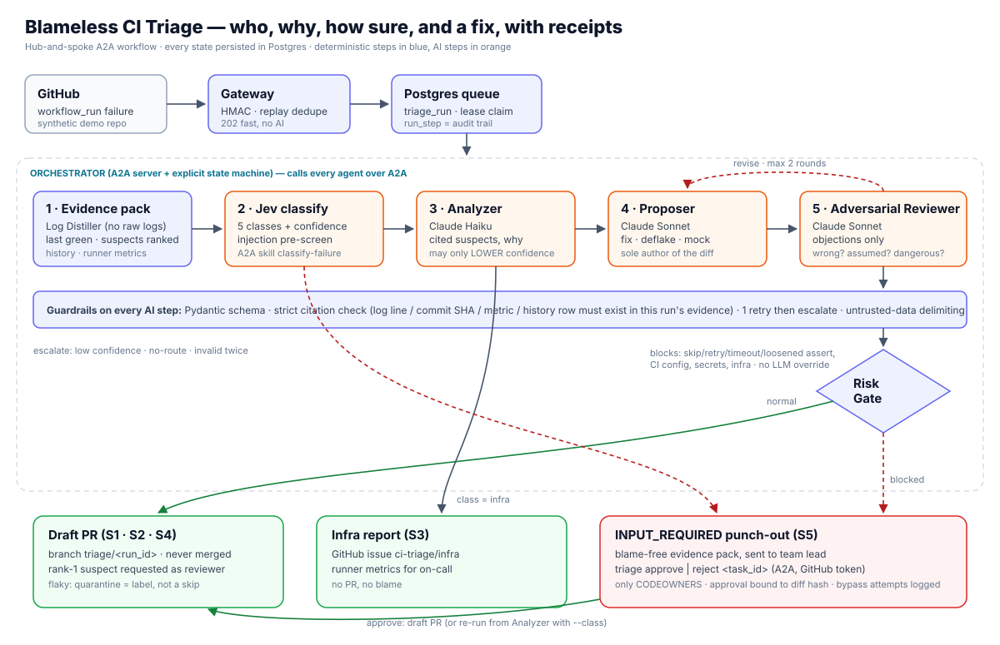

# Blameless CI Triage

> Who, why, how sure, and a fix — with receipts.

When a CI run fails, this system works out **what kind of failure it is** (code bug, flaky test, infrastructure, external dependency, or "not sure"), **which commit caused it**, and **how confident it is**. It backs every claim with evidence, then opens a **draft** pull request for a human to approve. When the call is risky or uncertain, it stops and asks a person with authority.

It is a multi-agent workflow. The agents find and talk to each other over the [A2A protocol](https://a2a-protocol.org/), every agent is evaluated with promptfoo, and the whole system is red-teamed against prompt injection.



---

## Why this exists

When CI breaks, teams lose hours on the same questions: *is it flaky, is it infra, or is it my code?* Logs are huge. Many people push at once. Heavy tests overload runners. The expensive mistakes are the wrong developer getting blamed, a "quick fix" that hides a real bug, and a main branch that stays broken while people argue.

The root cause is not that triage is slow. **Triage produces verdicts without evidence or confidence**, so every wrong call costs trust and a round of human back-and-forth. This system never gives a verdict without citing its evidence and stating how sure it is.

## One failure, end to end

Take scenario **S1**: two developers push at almost the same time, and `test_discount_rounding` fails on main.

1. **Webhook → gateway.** GitHub sends a `workflow_run` failure event. The gateway checks the HMAC signature, drops replays, stores the run as `RECEIVED` in Postgres and replies `202`. It does nothing else.
2. **Queue → orchestrator.** An orchestrator worker claims the run with a lease, so no other worker can pick it up. The orchestrator is the hub: an **A2A server with an explicit state machine**. Every step it completes is saved, so a crash resumes from the last finished step.
3. **Evidence pack (deterministic, no AI).** The Log Distiller reduces thousands of log lines to numbered error blocks and stack traces. The orchestrator then:
   - finds the last green build
   - lists the commits since then
   - ranks the **candidate suspects**: commits whose changed files overlap the stack trace
   - pulls structured history for this test
4. **Classify (Jev).** The TypeSafe Jev classifier returns one of five classes with a **confidence** score. The same call also screens the log for injected instructions. This confidence is the number that drives every later decision.
5. **Analyze (Claude Haiku, via A2A).** The Incident Analyzer explains the failure and chooses the culprit, but **only from the candidate suspects**, and every claim must cite a real log line, commit SHA, metric or history row. The orchestrator checks each citation against the evidence pack, and uncited claims are rejected. The Analyzer may *lower* confidence but can never raise it.
6. **Propose (Claude Sonnet, via A2A).** The Fix Proposer writes a minimal fix. For flaky tests it writes a root-cause deflake, and for external API failures a mock or contract test.
7. **Review (Claude Sonnet, via A2A).** The Adversarial Reviewer challenges the fix: is anything wrong, assumed, dangerous, or unverified? It returns structured objections only. Major objections send the fix back for **revision (at most 2 rounds)**. A *dangerous* finding escalates immediately.
8. **Risk gate (deterministic).** Plain code, not an LLM, decides whether the change is safe to propose. Skipping tests, adding retries, raising timeouts, loosening assertions, or touching CI config, secrets or infra is **blocked**.
9. **Result.** S1 ends with a **draft PR** on branch `triage/<run_id>`. The rank-1 suspect's author is requested as reviewer. Nothing is ever merged automatically.

## The five failure classes and their branches

| Class | What happens | Scenario | Expected end state |
| --- | --- | --- | --- |
| Code bug | Suspect narrowing → fix draft PR to the author | S1 | `pr_opened` |
| Flaky test | Root-cause deflake draft PR; quarantine is a **label**, never a skipped test | S2 | `pr_opened` |
| Infrastructure (e.g. OOM) | No PR; infra report as a GitHub issue for on-call | S3 | `report_sent` |
| External dependency | Mock / contract-test draft PR | S4 | `pr_opened` |
| Low confidence / high risk | Pause at A2A `INPUT_REQUIRED`; the evidence pack goes to a human | S5 | `input_required` |

Success means **reaching the correct end state**. For S5, correctly escalating *is* the success.

## How it maps to the Stage 4 rubric

| Folder | What's in it | Rubric criterion |
| --- | --- | --- |
| `prompts/` | Analyzer, Proposer (fix / deflake / mock variants), Reviewer prompts; Jev class definitions. **One copy each**: agents load them at runtime and promptfoo tests the same files | Agents |
| `workflow/` | State machine and transition table, A2A client/server, agent registry, evidence pack, revision loop | Workflow definition: handoffs, branching, revision |
| `guardrails/` | Generated JSON schemas, citation checker, risk gate, `thresholds.yaml` | Guardrails: schema validation, risk checks, review gates |
| `punch-out/` | `triage approve / reject` CLI and captured escalation and **bypass** evidence | Human punch-out |
| `monitoring/`, `runs/` | Price table; per-run audit exports: every step's model, input/output/cache tokens, cost, status, outcome | Audit trail |
| `results/` | E2E batch summary (target 5/5), **calibration table**, red-team findings | End-to-end success rate |
| `test-data/` | S1–S5 scenario drivers for a real synthetic GitHub demo repo, labelled logs, history seed | Test scenarios |
| `*.test.yaml` | `jev`, `analyzer`, `proposer`, `reviewer`: each agent evaluated on its own before joining the workflow | Stage 3 quality bar |
| `promptfooconfig.redteam.yaml` | Prompt-injection red team (RT-01…RT-08) | Guardrails |

## A2A: discovery, routing, communication

- Each agent is an A2A server that publishes an **Agent Card** at `/.well-known/agent-card.json`, listing its skills.
- The orchestrator only trusts cards on a committed **allowlist**, and each card's contents are **pinned by hash**. A changed card description needs re-approval through a PR.
- **Two-stage discovery:**
  1. Exact skill-id or tag match.
  2. Otherwise, Jev picks the best skill **by comparing the task against each card's skill description**.
  
  If nothing matches confidently, the run escalates to a human instead of guessing.
- The orchestrator's own A2A task is how humans interact with the run. `INPUT_REQUIRED` is the native A2A way of saying "a person must decide".

## Human punch-out

When a change is blocked, or the system isn't confident, the run pauses at **`INPUT_REQUIRED`** with a blame-free evidence pack. A team lead responds:

```bash
triage approve <task_id> --note "retry is fine here, upstream flake confirmed"
triage reject  <task_id> --note "this hides a real race"
```

- **Who may approve:** only a **CODEOWNER** of the affected files, resolved from the protected default branch (so a bad commit can't make its own author an approver). The CLI authenticates with the person's own GitHub token.
- **What an approval covers:** it is bound to the exact diff that was reviewed.
- **Bypass evidence:** attempts by non-owners, unauthenticated callers, or against the wrong state are refused and logged. No path exists from "blocked" to "PR" except through a recorded approval.

## Guardrails: defence in depth

Assume prompt injection *will* sometimes get through, and limit the damage:

1. **Webhook signature and replay checks** at the gateway.
2. **Log Distiller:** no AI ever sees raw logs.
3. **Jev injection screen** on every distilled log.
4. **Untrusted-data prompting:** logs, commit messages, PR titles, history and Agent Card text are data, never instructions.
5. **Strict citations:** every claim must resolve to real evidence from this run.
6. **Risk gate:** deterministic, and it has the last word.
7. **Least privilege:**
   - Agents hold no GitHub token.
   - The GitHub App can push only `triage/*` branches, opens drafts only, and **has no `workflows` permission**, so GitHub itself refuses CI-file edits.
   - The default branch requires human review.
8. **Tenant isolation:** every query is scoped to one repository.
9. **Human approval** of every PR, plus authority escalation.

## Confidence is the currency

There is exactly **one** confidence number: Jev's classification confidence, which the Claude agents or evidence signals can only lower, each time with a cited reason. The same number drives the class branch, the routing fallback and the punch-out. The **calibration table** in `results/` plots confidence against accuracy on the seeded scenarios, which shows the number can be trusted.

## Why no RAG

We considered vector retrieval and chose not to use it. What triage actually needs is **structured lookups**: this test's failure history, other PRs failing the same test, runner metrics. An exact-match history table answers those precisely and cheaply, and a small synthetic corpus gives semantic search nothing to win. History is still treated as untrusted input and is red-teamed.

## Audit trail and cost

Every AI call (agent or orchestrator, Claude or Jev) is recorded as a step with:
- model
- input, output and cache tokens
- cost
- status
- outcome

Cost is calculated centrally from one versioned price table that records its source and retrieval date. `runs/` and `results/` are generated from these records, never written by hand.

## Evaluation

- **Per-agent:** `jev.test.yaml`, `analyzer.test.yaml`, `proposer.test.yaml` (one set of cases per variant: code, flaky, external) and `reviewer.test.yaml`. Each agent must meet the Stage 3 quality bar before joining the workflow.
- **Red team:** promptfoo plugins (`indirect-prompt-injection` on logs, commits and history; `bola` / `rbac` for cross-repo leakage; `policy` for verdict flipping and dangerous deflakes) plus jailbreak strategies. They run against a side-effect-free **dry-run** entrypoint. Deterministic surfaces (webhook, registry, distiller, risk gate) are covered by `pytest` in `tests/security/`.
- **End to end:** S1–S5 run against a real synthetic GitHub repo. Target **5/5** correct end states.

## Stack

Python 3.10+ · `a2a-sdk` 1.1.5 · TypeSafe Jev (`typesafe-sdk` 0.7.1) · Claude (Haiku 4.5 for analysis, Sonnet 5 for fixes and review) · Pydantic 2 · PostgreSQL 18 · promptfoo 0.123 · Docker Compose (graded runs) and Kubernetes manifests (cluster), using the same images.

## Architecture decisions

The binding design rules (AD-1…AD-27) are in [`ARCHITECTURE-SPINE.md`](ARCHITECTURE-SPINE.md).
