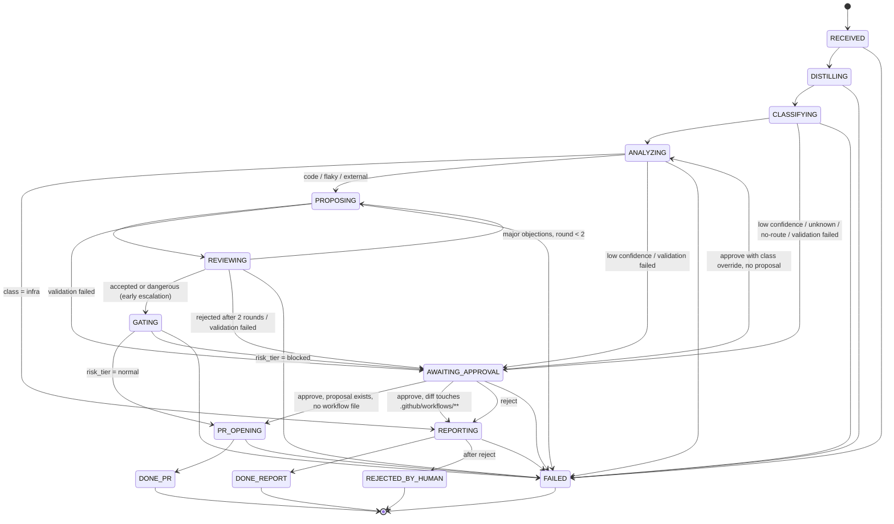

# Run state diagram
<!-- Generated from the AD-1 transition table in workflow/transitions.py; do not edit by hand. -->
<!-- Regenerate: python scripts/generate_state_diagram.py; drift gate: make state-diagram-drift -->

